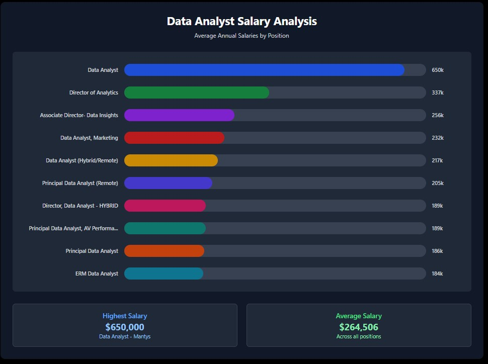

# About the Author
Hello everyone 👋, My name is **Harris Tosuk**, I'm a college student who studying in business with a background in IT. I'm excited to share my first Data Analysis project. I've always believed that having both technical skills is a powerful combination. And i hope this project may inspires some of you who are looking to try something new or want to blend your skills in a similar way.✨

# Introduction
📊 Welcome to my SQL project, where I delve into the data job market with a focus on data analyst and related roles, aiming to the key insights into top-paying jobs, the most in-demand skills, and the optimal skill sets for maximizing career value based in 2023.

**Check out all of my queries and detailed analysis here :** [project_sql folder](/project_sql)
# Background
The motivation behind this project stems from my personal desire to understand SQL and gain a deeper insight into the data analyst job market. I aimed to discover which skills are the highest paid and most in-demand, thereby making my research more effective and valuable.

The questions I wanted to answer through my SQL queries were:
1. Where are the top_paying data analyst and related jobs considering working from home? 
2. What are the most in-demand skills for data analysts and Data Scientist?
3. What are the top skills based on salary?
4. What are the most optimal skills to learn in high demand and a high-paying skill?

# Tools I used
For my deep dive into the data analyst job market, I managed to use several key tools to perform my analysis and manage the project:

- **SQL :** The backbone of the analysis, used for all data querying and manipulation.

- **PostgreSQL :** The database management system used to store and manage the job data.

- **Visual Studio Code :** My primary environment for writing SQL and managing project files.

- **Git & GitHub :** Essential for version control and collaborating on the project.

# The Analysis
Each query for this project aimed at investigating specific aspects of the data analyst job market. Here’s how I approached each question:
### 1. Top Paying Data Analyst Jobs
To identify the highest-paying roles, I filtered data analyst positions by average yearly salary and location, focusing on remote jobs. This query highlights the high-paying opportunities in the field.
```sql 
SELECT	
	job_id,
	job_title,
	job_location,
	job_schedule_type,
	salary_year_avg,
	job_posted_date,
    name AS company_name
FROM
    job_postings_fact
LEFT JOIN company_dim ON job_postings_fact.company_id = company_dim.company_id
WHERE
    job_title_short = 'Data Analyst' AND 
    job_location = 'Anywhere' AND 
    salary_year_avg IS NOT NULL
ORDER BY
    salary_year_avg DESC
LIMIT 10;
```
Here's the breakdown of the top data analyst jobs in 2023:
- **Wide Salary Range :** Top 10 paying data analyst roles span from $184,000 to $650,000, indicating significant salary potential in the field.
- **Diverse Employees :** Companies like SmartAsset, Meta, and AT&T are among those offering high salaries, showing a broad interest across different industries.
- **Job Title Variety :**  The wide range of job titles, from Data Analyst to Director of Analytics, reflects varied roles and specializations within the field.



# What I Learned
# Conclusions
