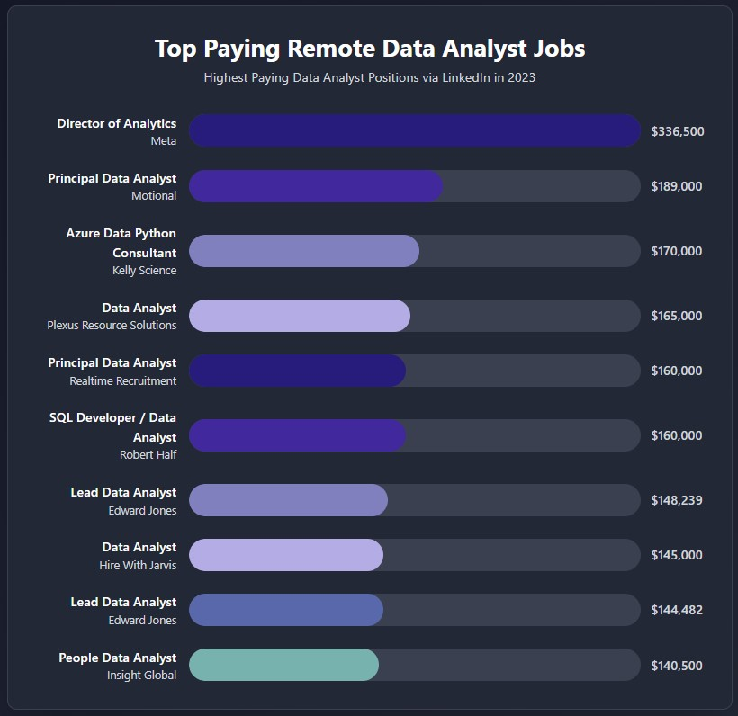

# 👋🏻 About the Author
Hello everyone 👋, My name is **Harris Tosuk**, I'm a college student who studying in business with a background in IT. I'm excited to share my first Data Analysis project. I've always believed that having both technical skills is a powerful combination. And i hope this project may inspires some of you who are looking to try something new or want to blend your skills in a similar way.✨

# 📚 Introduction
Welcome to my SQL project, where I delve into the data job market with a focus on data analyst and related roles, aiming to the key insights into top-paying jobs, the most in-demand skills, and the optimal skill sets for maximizing career value based in 2023.

**Check out all of my queries and detailed analysis here :** [project_sql folder](/project_sql)
# 🧾 Background
The motivation behind this project stems from my personal desire to understand SQL and gain a deeper insight into the data analyst job market. I aimed to discover which skills are the highest paid and most in-demand, thereby making my research more effective and valuable.

The questions I wanted to answer through my SQL queries were:
1. Where are the top 10 paying remote data analyst jobs on LinkedIn ?
2. What are the most in-demand skills for Data analysts and Data Scientist?
3. What are the top skills based on salary?
4. What are the most optimal skills to learn in high demand and a high-paying skill?

# 🧰 Tools I used 
For my deep dive into the data analyst job market, I managed to use several key tools to perform my analysis and manage the project:

| Tool / Library  | Purpose |
| --------------- | -------- |
| **PostgreSQL**  | Database engine for SQL execution and data manipulation |
| **VS Code** | SQL development and testing environment |
| **Git & GitHub** | Version control and project collaboration |
| **CTEs, Joins, Aggregations** | SQL techniques for relational data analysis |
| **Markdown** | For clear project documentation (this file) |

# The Analysis
Each query for this project aimed at investigating specific aspects of the data analyst job market. Here’s how I approached each question:
### 1. Top Paying Remote Data Analyst Jobs
To identify the highest-paying remote roles, I filtered data analyst positions by average salary (yearly) via LinkedIn, focusing on remote jobs and available.


```sql 
SELECT	
    job_title AS Title,
    company_dim.name AS Company_Name,
    job_posted_date::DATE,
    ROUND(salary_year_avg, 0) AS Salary_yearly
FROM
    job_postings_fact
LEFT JOIN company_dim ON job_postings_fact.company_id = company_dim.company_id
WHERE
    job_title_short = 'Data Analyst' AND 
    job_work_from_home = true and 
    job_via = 'via LinkedIn' and
    salary_year_avg IS NOT NULL
ORDER BY
    salary_year_avg DESC,
    job_id
LIMIT 10;
```

Here's the breakdown of the top remote data analyst jobs in 2023:

- **Wide Salary Range :** Top 10 remote data analyst roles on LinkedIn span from $140,500 to $336,500, indicating significant salary potential in the field, especially in senior positions.
- **Diverse Industries :** High-paying roles are offered by a variety of companies, including big tech (Meta), automotive tech (Motional), financial services (Edward Jones). The results show that data analyst skills are highly valued across different sectors.
- **Career Progression :**  The job titles in the top results, indicate that higher salaries are strongly correlated with experience and leadership responsibilities.



*<p align="center">Bar graph showing the salary for the top 10 salaries for data analysts</p>*

### 2. In-Demand Skills for Data Analyst 
To identify the skills most frequently requested in job postings, directing focus to areas with high demand.

``` sql 
SELECT 
    skills,
    COUNT(skills_job_dim.job_id) AS demand_count
FROM job_postings_fact
INNER JOIN skills_job_dim ON job_postings_fact.job_id = skills_job_dim.job_id
INNER JOIN skills_dim ON skills_job_dim.skill_id = skills_dim.skill_id
WHERE
    job_title_short in ('Data Analyst','Data Scientist')
    AND job_work_from_home = True 
GROUP BY
    skills
ORDER BY
    demand_count DESC
LIMIT 5;
```
# What I Learned
# Conclusions


# Tools i used 
